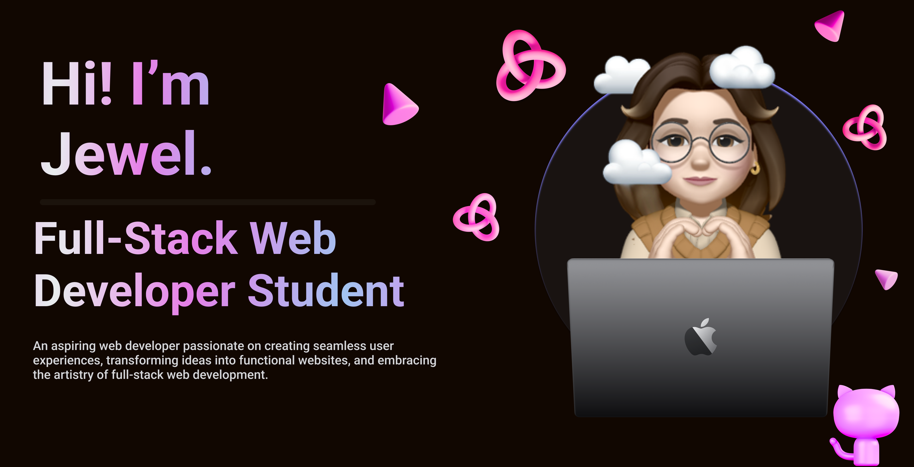
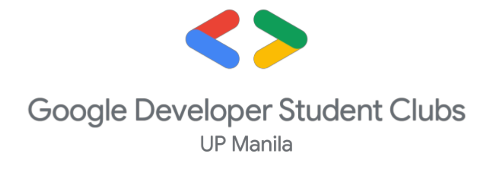

<h1 align="center">
  
</h1>
<h3 align="center">
  
</h3>

<h3 align="left">Academics: </h3>

  <ul>
    <li>Currently pursuing a degree of Bachelor of Science in Computer Science at the University of the Philippines - Manila</li>
    <li>Major in Health Informatics</li>
  </ul>

<h3 align="left">Organizations: </h3>

<h5>University of the Philippines Society of Computer Scientists (UP SoComSci)</h5>
<h6> 
  <ul>
    <li>VP for Members (2023 - Current)</li>
    <li>BM for Logistics and Career Development (2022 - 2023)</li>
    <li>Creatives Committee Member ( 2021 - 2022)</li>
  </ul>
</h6>

<h5>Google Developer Student Clubs - UP Manila(GDSC)</h5>
<h6>
  <ul>
    <li>Chief Technology Officer (2023 - Current)</li>
    <li>Creatives and Branding Officer (2022 - 2023)</li>
  </ul>
</h6>

<h5>Level UP Manila</h5>
<h6>
  <ul>
    <li>Head of Marketing (2023 - Current)</li>
  </ul>
</h6>

<h3 align="left">Connect with Me: </h3>

<h3 align="left">Languages and Tools:</h3>

                    

